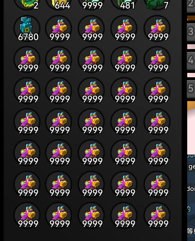

This is cache from reddit: https://www.reddit.com/r/Trove/comments/vli2q8/duplicate_item_bug/

This page may be complained by the developer and deleted, please copy or fork by yourself.

update:this bug still work, you can copy and transfer stolen goods when the staff is not at work.
It's stupid to use human review, won't even check inventory.

----------------------------------------------------------------------------------------------------

This really annoys me, the developers knew about this bug for years and never intended to fix it.

The Chinese agency had to terminate the contract because of this bug.

Goal: Copy any item that can be sold on the market.

Success rate: low, it may only succeed once in a few hours, but you can get a lot of profit as long as you succeed once.

Implementation method: two accounts (buyer and seller), the buyer creates a high-latency network environment, the seller sells the item he wants to copy, and cancels the order and the purchase order at the same time, when the buyer has an "unavailable" error, switch world(as fast as you can), with a probability to return items to the reward list.

Guess: what the hell happened?

Maybe one day, someone is trading in the market, and his friend invites him and teleports it to a new world, and then he finds that he has lost the purchased item and consumed the flux.

The server of each world is independent. When the server processing the market is dealing with purchase errors, if the player is no longer on that server, the reward will not be sent, so the developer created this method to compensate for this bug in order to solve this bug, but unfortunately , creating a more vicious bug.

If you understand the RMT market, the market inflation rate is over 200% in just one month, that's why, because a lot of fake flux flowed into the market, they refused to fix the bug, they tried to ban the account, but it didn't work.

It's no secret that you can buy the use of these bugs for only $5.

Hope everyone is working hard to save this game, it's so frustrating.

Duplication of some items will ban, such as: Megaflux Tank.

But you can use an empty account to copy and trade to others for profit,

For example: Frosty Treasure Box, diggsly.

A month ago, the price of crystal pinata was only 5000, because this is also a copy. But now there is no one in the market to copy crystal pinata, but it is not sure whether it has been banned like Megaflux Tank.
